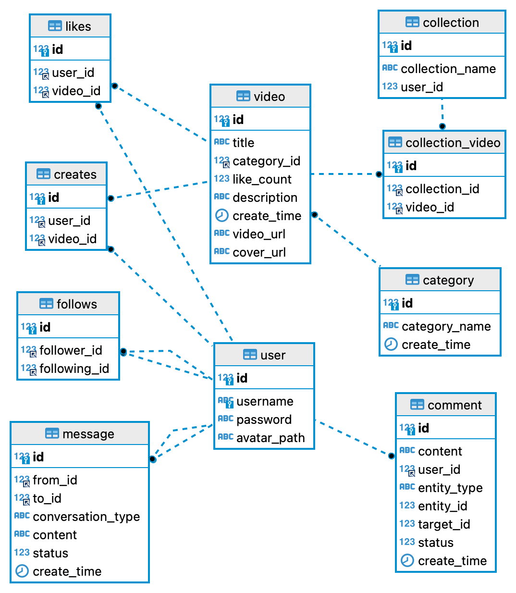
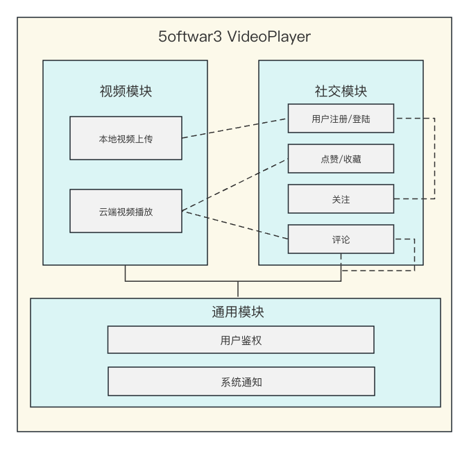
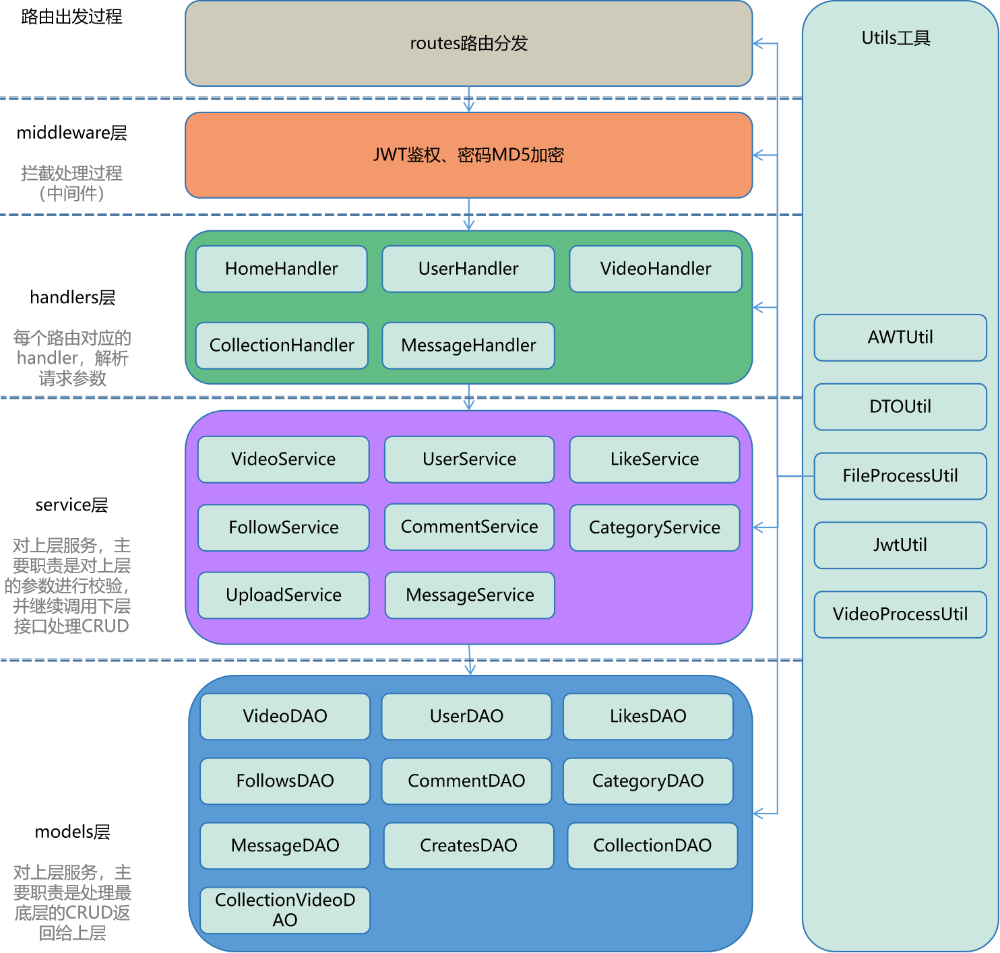

## VideoPlayer - ZJU5oftwar3

该项目为[七牛头2023年1024创作节](https://www.qiniu.com/activity/detail/651297ed0d50912d3d53307b?from=0010)参赛作品

Demo讲解及演示视频链接：

七牛云外链：[点击这里](http://s33fgajdq.hd-bkt.clouddn.com/demo.mp4) （可能需要缓冲一段时间）

哔哩哔哩：

---
### 目录
* [数据库说明](#数据库说明)
  * [数据库ER图](#数据库ER图)
  * [数据库建立说明](#数据库建立说明)
* [架构说明](#架构说明)
  * [功能模块图](#功能模块图)
  * [底层架构图](#底层架构图)
* [各模块详细说明](#各模块详细说明)
  * [视频模块](#视频模块)
  * [社交模块](#社交模块)
  * [通用模块](#通用模块)
* [后续](#后续)
---
## **数据库说明**

### 数据库ER图




### 数据库建立说明
可通过该项目静态资源文件夹 `resources/sql` 文件夹下找到建表对应的SQL语句

启动`Mysql`服务后，执行以下命令：
```sql
source  ${project_path}/resources/sql/create_table.sql
```


## **架构说明**

### 功能模块图



### 底层架构图



> 以用户登录为例共需要经过以下过程：

1. 进入中间件`SHAMiddleWare`内的函数逻辑，得到`password`明文加密后再设置`password`。具体需要调用`gin.Context`的 Set 方法设置 `password`。随后调用 `next()` 方法继续下层路由。
2. 进入`UserLoginHandler`函数逻辑，获取`username`，并调用`gin.Context`的`Get`方法得到中间件设置的`password`。再调用`service`层的`QueryUserLogin`函数。
3. 进入`QueryUserLogin`函数逻辑，执行三个过程：`checkNum`，`prepareData`，`packData`。即检查参数、准备数据、打包数据，准备数据的过程中会调用 `models`层的`UserLoginDAO`。
4. 进入`UserLoginDAO`的逻辑，执行最终的数据库请求过程，返回给上层。

### 各模块详细说明

---

#### 视频模块

**本地视频上传**

- 基本功能：用户可以将本地视频及相关信息上传至服务端，以供其他用户进行点赞、评论等操作
- 核心接口定义

```java
/**
* 上传对应文件至云服务器
* @param localFileUrl 本地文件路径
* @param dataServer   云服务器相关信息
* @return
*/
UploadFileInfoDTO uploadfile(String localFileUrl, QNDataServer dataServer);
UploadFileInfoDTO uploadfile(String fileName, byte[] data, QNDataServer dataServer);
```

- 实现细节
    - 上传接口提供两种上传方式，本地 **url / 字节数组** 上传至**对象存储Kodo服务器**
    - 底层通过**七牛云对象存储 Java SDK**来实现，支持本地文件路径/字节数组上传方式

**云端视频播放**

- 基本功能：可以通过 `video` 表中的`videoId` 获取视频的外链地址，在前端实现播放、暂停、拖拽等动作
- 核心接口定义

```java
// 通过videoId获取视频详细信息
VideoInfoDTO getVideoInfoById(Long videoId);
```

- 实现细节
    - 视频对象通过上传接口上传至对象存储服务器后，在 `video` 数据表中记录了相关信息，包括云存储资源外链
    - 前端调用后端接口时，提供云端资源外链，实现视频资源的获取

---

####  社交模块
**登录**

- 基本功能：根据用户名和密码进行登录
- 核心接口定义:

```java
// 根据用户名及密码进行登录
User login(UserLoginDTO userLoginDTO);
```

- 实现细节
  - 登录后会产生token，用于后续用户的鉴权

**注册**

- 基本功能：使用用户名以及密码进行注册
- 核心接口定义：

```java
// 使用用户名及加密后的密码进行注册
User registry(UserRegisterDTO userRegisterDTO);
```

- 实现细节：
  - 密码采用md5加密存储，提高了密码存储的安全级别


**更新用户信息**

- 基本功能：更新用户信息，如姓名，密码，头像等
- 核心接口定义：

```java
// 更新用户信息
int update(User user);
```

- 实现细节：
  - 用户的头像需先上传至七牛云中，再将连接保存至数据库中

**获取用户信息**

- 基本功能：获取用户基本信息，如用户名，头像等
- 核心接口定义：

```java
// 根据用户id获取用户基本信息
User getUserById(Long id);
```

**点赞**

- 基本功能：点赞、取消点赞、查看点赞视频
- 核心接口定义：

```java
// 点赞
int like(Likes likes);
// 取消点赞
int unlike(Likes likes);
// 获取点赞过的视频
PageResult getLikes(Long userId, LikesPageQueryDTO likesPageQueryDTO);
// 判断用户是否点赞过该视频
boolean isAlreadyLiked(Long userId, Long videoId);
```
- 实现细节：
  - 获取点赞视频时，根据page和pageSize进行分页获取

**关注**

- 基本功能：关注用户、取消关注用户、查看关注列表、查看粉丝列表
- 核心接口定义：

```java
// 关注
int follow(Follows follows);
// 取消关注
int unfollow(Follows follows);
// 分页获取关注的用户
PageResult getFollowings(FollowingsPageQueryDTO followingsPageQueryDTO);
// 分页获取粉丝
PageResult getFollowers(FollowersPageQueryDTO followersPageQueryDTO);
// 判断是否关注了该用户
boolean isAlreadyFollowed(Long followerId, Long followingId);
```

**收藏**

- 基本功能：创建收藏夹，删除收藏夹，收藏视频，取消收藏视频，查看收藏的视频
- 核心接口定义：

```java
// 创建收藏夹
int createCollection(Long userId, String collectionName);
// 删除收藏夹
int removeCollection(Long collectionId);
// 获取收藏夹列表
PageResult getCollectionsByUserID(Long userId, PageQueryDTO pageQueryDTO);
// 将视频收藏到某个收藏夹中
int collect(Long collectionId, Long videoId);
// 将视频从收藏夹中移除
int cancelCollect(Long collectionId, Long videoId);
// 分页获取收藏夹中的视频
PageResult getCollectionVideoByCollectionId(Long collectionId, PageQueryDTO pageQueryDTO);
```

**视频评论**

- 基本功能：实现用户对视频进行评论，同时支持用户对他人评论进行评论
- 核心接口定义（选一些有代表性的）：

```java
// 用户对实体（视频/评论）进行评论
Long comment(CommentPO commentPO);
// 获得某一视频下的所有评论信息
List<VideoCommentDTO> getCommentByVideoId(Long videoId);
```


- 实现细节

    - 评论表中的 `entity_type` 字段来区分评论类型
    - 获取某一视频下的评论时，对每一个评论，需要递归在表中获取针对该评论的下一级评论，组成 `VideoCommentDTO`

---

### 通用模块

#### 系统通知

- 基本功能：在关注，点赞，评论时，会向对应用户发送系统通知
- 核心组件定义

```java
/**
 * 事件通知的生产者，底层通过消息队列Kafka实现，需引入spring的KafkaTemplate组件
 */
@Component
public class EventProducer {
    @Autowired
    private KafkaTemplate kafkaTemplate;
    // 发布事件
    public void fireEvent(Event event){
        // 将事件发送到指定主题
        kafkaTemplate.send(event.getTopic(), JSONObject.toJSONString(event));
    }
}
/**
 * 事件通知的消费者，订阅 FOLLOW、LIKE、COMMENT 主题，收到消息后，向message表里插入对应数据
 */
@Component
public class EventConsumer extends MessageConstant {
    @Autowired
    private MessageService messageService;
    @KafkaListener(topics = {TOPIC_FOLLOW, TOPIC_LIKE, TOPIC_COMMENT})
    public void handleCommentMessage(ConsumerRecord record) {
        Event event = JSONObject.parseObject(record.value().toString(), Event.class);
        MessagePO build = MessagePO.builder()
                .fromId(event.getUserId())
                .toId(event.getEntityUserId())
                .build();
        messageService.insertMessage(build);
    }
}
```

- 实现细节
    - 点赞、收藏、评论等频繁的交互动作，如果系统通知每次都与底层 `DB` 交互会十分耗时，通过引入消息队列Kafka，用于实时流数据的发布和订阅，达到低数据延迟的目的
    - 不同的交互在Kafka中对应不同的Topic，在进行信息消费时，使用 `Json` 方式对数据进行反序列化

#### 登陆鉴权

- 基本功能：根据token进行鉴权
- 核心接口定义：

```java
public static Claims parseJWT(String secretKey, String token);
```

## **后续**
- 前后端交互时个别请求会超时，可以考虑引入缓存 `Redis`
- 增加推荐及直播功能，向用户精准推荐
- 页面适配不足，目前整体页面的结构比较固定，对于不同大小的设备无法做到很好的适配，后续可以修改大小为百分比以及弹性适配，贴合移动端
- 代码结构不太清晰，采用VUE2的方式去编写方法和数据会导致整体比较分割，不利于维护，未来可以考虑升级为VUE3采用组合式API的方式，让代码结构更加清晰
